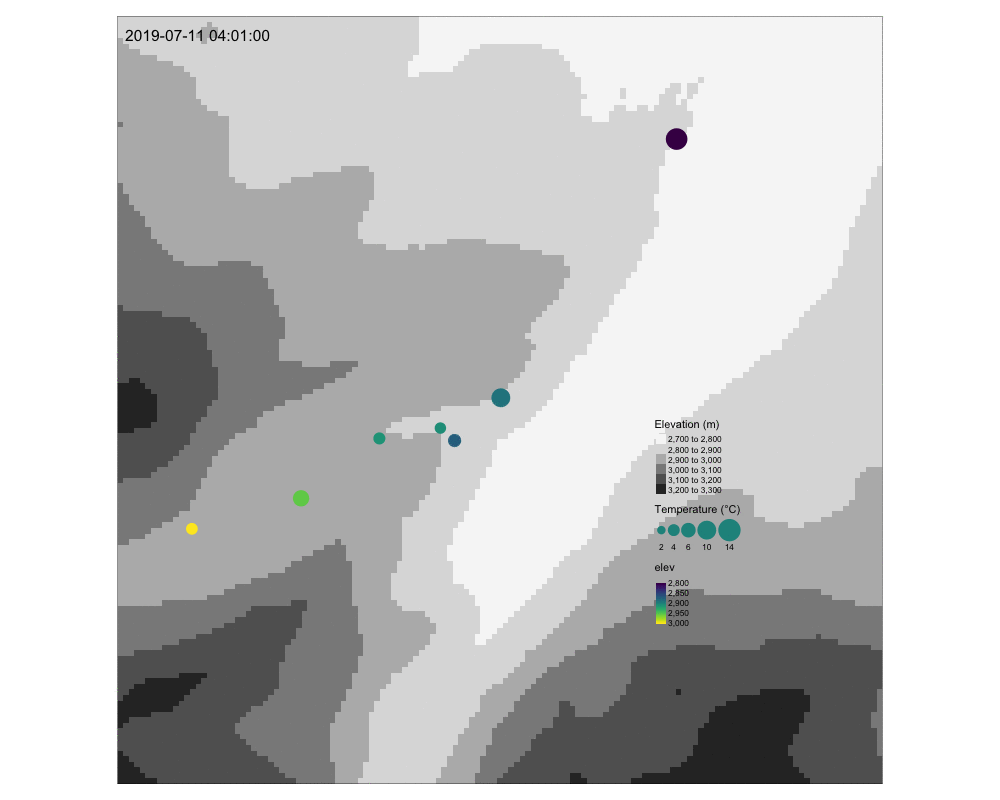

```{r setup, include=FALSE}
library(dplyr)
library(tidyverse)
library(tidyr)
library(lubridate)
library(xts)
library(dygraphs)
library(sf)
library(raster)
library(USAboundaries)
library(mapview)
library(animation)
library(purrr)
library(tmap)
library(ggpubr)


knitr::opts_chunk$set(echo = TRUE, warning = FALSE, message = FALSE)

```

# Introduction

Lapse rate is often needed for calculating temperature gradients which is important when modeling hydrological resources in mountain driven watersheds. Lapse rate is often assumed to be -6.5 °C/km, and though this is a fine average of what's been found around the world, it is not accurate to assume this to be a 'catch-all' lapse rate for all environments. Applying an incorrect lapse rate to a study area will skew temperatures, and likely affect quantifying snow accumulation and snow melt that will affect hydrologic models. Temporal and spatial variability are key in understanding these varying lapse rates. Other work has been done modeling lapse rate in complex terrain using parameters that look at new variables such as seasonal and diurnal variability as well as windward vs leeward sides of a mountain. This study uses temperature data from eleven sites in the Colorado Rocky Mountains near Colorado State University's mountain campus in Bellvue, Larimer County, Colorado. Other work is currently being done in the area looking at spatial and temporal variation of temperature and comparing it to MODIS Land Surface Temperature data.

# Methods

## Study Area

The mountain campus sits at 2760 meters and is roughly 80 kilometers along the road from the city of Fort Collins, Colorado. The area was affected by the High Park fire in 2012, where some of the land is old forest filled with spruces and firs, while some of the land is new forest with a mix of young aspens and pines. The headwaters of the South Fork of the Poudre River exist within the surrounding mountains to the mountain campus. 

## iButton data

Eleven iButtons were placed in trees, each with a radiation shield. The transact was 4 kilometers long and ranged in elevation of 2787 meters - 3001 meters. There were 214 meters of elevation change to calculate these lapse rates.

The first sensors started collecting July 5th, 2019 and the last sensors were set up July 8th, 2019. The discrepancy of not having all sites running for the those three days can be seen throughout this paper. When all sites were collecting data, this is referred to as having all sites 'online', this happens July 8th, 2019 at 15:30. Data were collected on October 13th, 2019 and analyzed back in Fort Collins. 
All analysis was carried out in R.

## Analysis

Once the data was clean and organized, linear models were applied to average temperatures for the entire data collection period, daily averages, hourly data, and finally night and day averages. These range in resolution from coarse to fine, and most analysis was done with a medium-fine scale (the diurnal averages.) Night and day was determined by using sunrise and sunset data from the Dark Sky network. 

As a note, over the 31,906 observations from each of the eleven stations, there was not a single 'NA' in temperature data.


#### Reading in iButton data

```{r}

files <- list.files('data',full.names = T)

my_reader <- function(file){
  data_names = str_split_fixed(file,'_',2)[,1]
  name = gsub('data/','',data_names)
  df <- read_csv(file,) %>%
    dplyr::select(address, name, version, logging_interval)%>%
    rename('date' = 1,
           'temp' = 2)%>%
    mutate(temp = as.numeric(temp))%>%
    slice(-1,-2)%>%
    mutate(site = name)%>%
    mutate(site = replace(site, list=site=="BN29", values="BM29"))%>%
    dplyr::select(date, temp, site)
  return(df)
}

data_clean <- map_dfr(files,my_reader)

```

#### Hard coding elevation and UTM data with each site

```{r}

utmE <- c(449451, 449437, 449220, 449008, 448513, 448198, 447880, 446903, 449429, 448272, 447472)
  
utmN <- c(4491181, 4491210, 4491086, 4490502, 4489917, 4489759, 4489705, 4489234, 4491265, 4489694, 4489393)

elev <- c(2787, 2789, 2837, 2853, 2889, 2907, 2911, 3001, 2796.2, 2873, 2955)

site <- c('BM25', 'BM26', 'BM28', 'BM29', 'BM30', 'BM31', 'BM32', 'BM33', 'BM42', 'BM43', 'BM44')

location_data <- cbind(site, utmE, utmN, elev) %>%
  as.data.frame()

location_data_num <- location_data %>%
  mutate(site = as.character(site),
         utmE = as.numeric(as.character(utmE)),
         utmN = as.numeric(as.character(utmN)),
         elev = as.numeric(as.character(elev)))

```

#### Spatial site data and adding buffer for basemap

```{r} 

spatial_points <- location_data_num %>%
  st_as_sf(coords=c('utmE','utmN'), crs=26913)

buffer_point <- spatial_points %>%
  filter(site == "BM30")

buffer_2km <- st_buffer(buffer_point, 2000)

```

#### Location of 11 sites near the Mountain Campus and up Cirque Meadow Road

```{r}

co_elev <- elevatr::get_elev_raster(buffer_2km,z=11)

elev_clip <- crop(co_elev, buffer_2km)

basemap <- tm_shape(elev_clip) + 
  tm_raster(palette = 'Greys',
            title = "Elevation (m)")+ 
  tm_compass(type = "4star", size = 6)+
  tm_scale_bar(position = c(0.1, 0.05), text.size = 0.6)

tm_shape(elev_clip) + 
  tm_raster(palette = 'Greys',
            title = "Elevation (m)")+
  tm_shape(spatial_points) + 
  tm_dots(col = "elev",
          title = "Elevation of Sites (m)",
          style = "cont",
          size = 1.5, 
          palette ='viridis',
          alpha = 0.7)+
  tm_text('site', size = 0.7)+
  tm_compass(type = "4star", size = 6)+
  tm_scale_bar(position = c(0.1, 0.05), text.size = 0.6)

```

**Figure 1:** Location of 11 iButton sites in the Pingree Valley of Larimer County, Colorado. Sites increase in elevation approaching the West, Southwest side of the valley. The maximum change in elevation between sites is 214 meters.

#### Exploring temperature using dygraphs

```{r}

temp <- data_clean%>%
  dplyr::select(date, temp, site) %>%
  filter(!site == "BM21")%>%
  mutate(date = ymd_hm(date, tz='MST'))

temp_wide <- temp %>%
  spread(., key='site',
         value='temp')%>%
  filter_if(is.numeric, all_vars(!is.na(.)))

temp_xts <- temp_wide %>%
  xts(., order.by = .$date)

dygraph(temp_xts)%>%
  dyAxis('y', label='Temperature (°C)', valueRange=c(-15,40))


```

**Figure 2**: Interactive plot exploring hourly temperature at all sites.

# Results

#### Minimum, Average, and Maximum Temperature at the eleven sites

```{r}
merge_temp_location <- merge(temp, location_data_num, by ='site')

temp_avg_elev <- merge_temp_location%>%
  group_by(site, elev)%>%
  summarise(Maximum = max(temp),
            Average = mean(temp),
            Minimum = min(temp))%>%
  gather(., key = 'type', value = 'temp',
         -site, -elev)

temp_avg_elev$type <- factor(temp_avg_elev$type, levels = c('Minimum', 'Average', 'Maximum'))
  
ggplot(temp_avg_elev, aes(x=temp, y=elev, color=site))+
  geom_point()+
  theme_linedraw()+
  labs(x= 'Temperature (°C)', y='Elevation (m)')+
  facet_wrap(~type)

```

**Figure 3**: Minimum, Average, and Maximum temperature of the eleven sites. Note the spread between the three types of temperature per site.

### Linear regression using average temperature data (**coarse resolution**)

```{r}

overall_lapse <- merge_temp_location %>%
  group_by(site, elev)%>%
  summarise(avg_temp = mean(temp))%>%
  arrange(desc(elev))%>%
  mutate(elev_km = elev/1000)%>%
  as_tibble()

ggscatter(overall_lapse,
          x = "elev_km", 
          y = "avg_temp", add = "reg.line")+
  stat_cor(label.x = 2.94, label.y = 13) +
  stat_regline_equation(label.x = 2.950, label.y = 13.35) + 
  labs(x='Elevation (km)', y= 'Average Temperature (°C)')+
  theme_linedraw()

```

**Figure 4**: Linear model of average temperature per elevation. The slope of -19 indicates a lapse rate of 19°C per kilometer. This is the coarsest resolution of this lapse rate analysis. 

### Linear regression using daily temperature data (**medium resolution**)

```{r}
elev_data <- merge_temp_location%>%
  mutate(doy = yday(date))

ydays <- elev_data%>%
  pull(doy)%>%
  unique(.)

lm_fun<- function(x){
  elev_data_fil <- elev_data%>%
    group_by(site,doy)%>%
    summarize(meanTemp = mean(temp),
              elevation= mean(elev))%>%
    filter(doy == x)
  
  lapse_lm<- lm(meanTemp~elevation,data=elev_data_fil)
  
}

lapse_lm<- ydays%>%
  map(~lm_fun(.x))%>%
  set_names(ydays)

lapse_lm_sum<- lapse_lm%>%
  map(~summary(.x))

lapse_lm_slopes<- lapse_lm%>%
  map(~coef(.x)[2])%>%
  simplify()%>%
  tibble()%>%
  mutate(doy = ydays)%>%
  rename(lapse_rate=1)%>%
  mutate(lapse_km = lapse_rate*1000)%>%
  mutate(date = as.Date(doy, origin = "2019-01-01"))

lapse_lm_intercept <- lapse_lm %>%
  map(~coef(.x)[1])%>%
  simplify()%>%
  tibble()%>%
  mutate(doy = ydays)%>%
  rename(intercept = 1)%>%
  filter(intercept > 0)%>%
  mutate(date = as.Date(doy, origin = "2019-01-01"))

```

#### Plotting lapse rates & intercepts for hourly data

```{r}
ggplot(lapse_lm_slopes, aes(x=date, y=lapse_km))+
  geom_point()+
  theme_linedraw()+
  labs(x= 'Date', y='Lapse Rate (°C/km)')
```

**Figure 5**: Lapse rates in degrees Celsius per kilometer using daily data of the eleven sites. The initial four points are greater than the rest because not all of the sensors were 'online' yet, and the three sensors set up were all within 50 meters of each other, but had quite varying average temperatures. 

```{r}
ggplot(lapse_lm_intercept, aes(x=date, y=intercept))+
  geom_point()+
  theme_linedraw()+
  labs(x= 'Date', y='Temperature at Sea Level (°C)')

```

**Figure 6**: Coefficients of the daily regression. These would be temperatures at sea level if the lapse rate continued to lower elevations. This figure was included as most of the lapse rate from daily data have unrealistic lapse rate to apply to a larger scale. 

### Linear regression using hourly temperature data (**fine resolution**)

```{r}

hourly_lapse <- merge_temp_location %>%
  pull(date)

hourly_lm_fn <- function(x){
 filter_temp <- merge_temp_location%>%
    filter(date == x)
 
  hourly_lapse_lm <- lm(temp ~ elev, data = filter_temp)

}

hr_lapse_lm <- hourly_lapse%>%
  map(~hourly_lm_fn(.x))%>%
  set_names(hourly_lapse)

hr_lapse_summary <- hr_lapse_lm %>%
  map(~summary(.x))

hr_lapse_slopes <- hr_lapse_summary %>%
  map(~coef(.x)[2])%>%
  simplify()%>%
  tibble()%>%
  mutate(date = hourly_lapse)%>%
  rename(lapse_rate = 1)%>%
  mutate(lapse_km = lapse_rate * 1000)

```

#### Plotting Hourly Lapse Rate

```{r, echo = FALSE, warning = FALSE}

ggplot(hr_lapse_slopes, aes(x=date, y=lapse_km))+
  geom_point(size = 0.25)+
  theme_linedraw()+
  labs(x = 'Date', y = 'Lapse Rate (°C/km)')

```

**Figure 7**: Hourly lapse rate in degrees Celsius per kilometer over the eleven sites. The initial large values are from a lack of all sensors being 'online'. Figure 8 corrects for this. 

#### Calculating hourly lapse rate when all stations were 'online'

```{r}

station_count <- merge_temp_location %>%
  arrange(date)%>%
  group_by(date)%>%
  count(site = n())

time_step_all <- station_count %>%
  filter(site == 11) 

hr_lapse_corrected <- hr_lapse_slopes %>%
  filter(date > "2019-07-08 15:01:00") %>%
  dplyr::select(2,3)

ggplot(hr_lapse_corrected, aes(x = date, y = lapse_km))+
  geom_point(size = 0.7)+
  theme_linedraw()+
  labs(x= 'Date', y='Lapse Rate (°C/km)')

```

**Figure 8**: Hourly lapse rate in degrees Celsius per kilometer over the eleven sites. Most lapse rates are negative, though occasionally become positive indicating warmer air high in elevation. 

#### Plotting intercepts of hourly regression

```{r}
hr_lapse_coef <- hr_lapse_summary %>%
  map(~coef(.x)[1])%>%
  simplify()%>%
  tibble()%>%
  mutate(date = hourly_lapse)%>%
  rename(intercept = 1)%>%
  filter(date > "2019-07-08 15:01:00")

ggplot(hr_lapse_coef, aes(x = date, y = intercept))+
  geom_point(size = 0.5)+
  theme_linedraw()+
  labs(x = 'Date', y = 'Temperature at Sea Level (°C)')

```

**Figure 9**: Intercepts of the hourly linear regression models. There are some values that are realistic, but many of these intercepts are so large this indicates this model cannot be applied to a large scale. 

### Linear regression using day and night data (**medium-fine resolution**)

#### Pulling Sunrise and Sunset data from Dark Sky

This is commented out as to not request data from Dark Sky without an API key. 

```{r}
latitude <- 40.556899
longitude <- -105.611251

# starting_daily <- get_forecast_for(latitude, longitude, "2019-07-04T01:00:00",
#                                    units = "us", language = "en",
#                                   exclude = 'currently, hourly, minutely',
#                                   add_json = FALSE, add_headers =FALSE)
# combined_daily <- starting_daily$daily%>%
#   dplyr::select(1,4,5)
# 
# date_vector <- seq(from = as.Date("2019-07-05"), to = as.Date("2019-10-13"), by = 1)
# 
# for(i in as.list(date_vector)){
#     print(i)
#   a_timestamp <- paste(i, "T01:00:00", sep = "")
#   b_forecast <- get_forecast_for(latitude, longitude, a_timestamp, 
#                                  units = "us", language = "en",
#                                  exclude = 'currently, hourly, minutely',
#                                  add_json = FALSE, add_headers =FALSE)
#   c_forecast <- b_forecast$daily%>%
#     dplyr::select(1,4,5)
# 
#   combined_daily <- rbind(combined_daily, c_forecast)
# }
# 
# save(combined_daily, file = './combined_daily.Rdata')

load('./combined_daily.Rdata')

```

#### Merging sunrise/sunset data with temperature data 

```{r}
temp_data <- merge_temp_location %>%
  rename(datetime = date)%>%
  mutate(date = date(datetime))

combined_daily_for_merge <- combined_daily%>%
  mutate(date = seq(from = as.Date("2019-07-04"), 
                    to = as.Date("2019-10-13"), by = 1))

temp_sun_data <- merge(temp_data, combined_daily_for_merge, by = 'date')

```

#### Data organized by day/night and averaged

```{r}

day_and_night <- temp_sun_data %>%
  dplyr::select(-time)%>%
  mutate(day_night = ifelse(datetime > sunriseTime & datetime < sunsetTime,
                            'day', 'night'))%>%
  arrange(datetime)

day_night_average <- day_and_night %>%
  group_by(site, date, day_night)%>%
  summarise(avg_temp = mean(temp),
            elev = mean(elev),
            utmE = mean(utmE),
            utmN = mean(utmN))%>%
  arrange(date)

```

#### Plotting Day vs Night Averages

```{r}

ggplot(day_night_average, aes(x=date, y=avg_temp))+
  geom_point(size =0.5, aes(color = day_night))+
  scale_color_manual(values = c("orange", "black"))+
  facet_wrap(~site)+
  theme_linedraw()+
  labs(x='Date', y= 'Average Temp (°C)')

```

**Figure 10**: Average temperature of day and night in degrees Celsius of the eleven stations. 

#### Day and night regression

```{r}

day_night_wide <- day_night_average %>%
  spread(., key = 'day_night',
         value = 'avg_temp')%>%
  mutate(doy = yday(date))%>%
  arrange(doy)%>%
  mutate(elev_km = elev/1000)

ydays <- day_night_wide %>%
  mutate(doy = yday(date))%>%
  pull(doy)%>%
  unique()

day_lm_fun <- function(x){
 filter_temp <- day_night_wide%>%
    filter(doy == x)
 
  daily_lapse_lm <- lm(day~elev_km, data = filter_temp)
}

day_lm <- ydays%>%
  map(~day_lm_fun(.x))%>%
  set_names(ydays)

day_lm_slopes <- day_lm%>%
  map(~coef(.x)[2])%>%
  simplify()%>%
  tibble()%>%
  rename(Day = 1)%>%
  mutate(date = seq(from = as.Date("2019-07-04"), 
                    to = as.Date("2019-10-13"), by = 1))


night_lm_fun <- function(x){
 filter_temp <- day_night_wide%>%
    filter(doy == x)
 
  daily_lapse_lm <- lm(night ~ elev_km, data = filter_temp)
}

night_lm <- ydays%>%
  map(~night_lm_fun(.x))%>%
  set_names(ydays)

night_lm_slopes <- night_lm%>%
  map(~coef(.x)[2])%>%
  simplify()%>%
  tibble()%>%
  rename(Night = 1)%>%
  mutate(date = seq(from = as.Date("2019-07-04"), 
                    to = as.Date("2019-10-13"), by = 1))

```

#### Joining Night and Day Linear Models and Plotting

```{r}

night_day_lm <- merge(day_lm_slopes, night_lm_slopes, by = 'date')

night_day_slopes_long <- night_day_lm %>%
  gather(., key = 'Time',
         value = 'lapse_rate',
         -date)

ggplot(night_day_slopes_long, aes(x=date, y=lapse_rate))+
  geom_point(aes(color = Time))+
  scale_color_manual(values = c("orange", "black"))+
  theme_linedraw()+
  theme(legend.position = c(0.75, 0.75))+
  labs(x = 'Date', y = 'Lapse Rate (°C/km)')

```

**Figure 11**: Day versus night lapse rates in degrees Celsius per kilometer of the eleven sites. The night lapse rates were often smaller in magnitude then the day lapse rates, sometimes becoming positive.  

#### Zoomed in, while all iButtons were 'online'

```{r}

online_night_day_slope <- night_day_slopes_long%>%
  filter(date > "2019-07-13")

ggplot(online_night_day_slope, aes(x=date, y=lapse_rate))+
  geom_line(aes(color = Time))+
  scale_color_manual(values = c("orange", "black"))+
  theme_linedraw()+
  theme(legend.position = c(0.6, 0.85))+
  labs(x = 'Date', y = 'Lapse Rate (°C/km)')

```

**Figure 12**: Day versus night lapse rates in degrees Celsius per kilometer of the eleven sites corrected for when all station were 'online'. The night lapse rates were often smaller in magnitude then the day lapse rates, sometimes becoming positive. These data were connected with a line and not points as to show the two lapse rates rarely (if ever) overlap. The night lapse rates are almost always smaller in magnitude than day lapse rates.

#### Pulling R^2^ Values

```{r}
day_lm_sum_r <- day_lm %>%
  map(~summary(.x)$r.squared)%>%
  tibble()%>%
  rename(Day = 1)%>%
  mutate(date = seq(from = as.Date("2019-07-04"), 
                    to = as.Date("2019-10-13"), by = 1))

night_lm_sum_r <- night_lm %>%
  map(~summary(.x)$r.squared)%>%
  tibble()%>%
  rename(Night = 1)%>%
  mutate(date = seq(from = as.Date("2019-07-04"), 
                    to = as.Date("2019-10-13"), by = 1))

day_night_r <- merge(day_lm_sum_r, night_lm_sum_r, by = 'date')

day_night_r_long <- day_night_r %>%
  gather(., key = 'Time',
         value = 'R_squared',
         -date)

r_plotting_ready <- day_night_r_long %>%
  mutate(R_squared = as.numeric(as.list(R_squared)))%>%
  rename(dateR = 1, TimeR = 2)

```

#### Plotting R^2^ Values and creating data frame with slope and R Squared

```{r}
slope_R_all <- cbind(r_plotting_ready, night_day_slopes_long)%>%
  dplyr::select(3,4:6)

ggplot(r_plotting_ready, aes(x=dateR, y= R_squared))+
  geom_point(aes(color = TimeR))+
  scale_color_manual(values = c("orange", "black"))+
  theme_linedraw()+
  theme(legend.position = c(0.075, 0.11), legend.title=element_blank())+
  labs(x = 'Date', y = 'R Squared')

```

**Figure 13**: R^2^ values of day and night lapse rates. Day lapse rates often had much higher R^2^ values than night data.

#### Plotting R^2^ values and slopes (with and without correction)

```{r}
ggplot(slope_R_all, aes(x=date, y=lapse_rate, size=R_squared))+
  geom_point(alpha=0.67, aes(color=Time))+
  scale_color_manual(values = c("orange", "black"))+
  theme_linedraw()+
  labs(x = 'Date', y = 'Lapse Rate (°C/km)')
```

**Figure 14**: Day and night lapse rates along with R^2^ values plotted through time of the eleven stations. The smaller the point, the smaller the R^2^ value, and this often happened closer to a lapse rate of 0 °C/km. The initial values while only a few of the stations were 'online' still had sizable R^2^ values.

```{r}
slope_R_online <- slope_R_all %>%
  filter(date > "2019-07-08")

ggplot(slope_R_online, aes(x=date, y=lapse_rate, size=R_squared))+
  geom_point(alpha=0.67, aes(color=Time))+
  scale_color_manual(values = c("orange", "black"))+
  theme_linedraw()+
  labs(x = 'Date', y = 'Lapse Rate (°C/km)')

```

**Figure 15**: Day and night lapse rates along with R^2^ values plotted through time of the eleven stations with corrected data when all stations were 'online'. The smaller the point, the smaller the R^2^ value, and this often happened closer to a lapse rate of 0 °C/km.

# Discussion

Picking which model to use is a function of the resolution that is desired. For our purpose, it was logical to use diurnal averages and those data had some noticeable differences. Night lapse rates were often in smaller in magnitude than day lapse rates, but also had a lower R^2^ value which indicates more variation between sites. The few positive lapse rates could indicate cold air drainage into the valley system. 

This is only the beginning of this study, and the next parts of the analysis will include lapse rates for dusk and dawn (the averages of temperature data for the few hours before/after sunrise/sunset) and compare sites of differing characteristics. For example, BM31 sits in old forest whereas BM30 sits in new forest. These sites have a difference of 18 meters in elevation, though a small analysis showed quite the different temperatures. 

This analysis sought to carry-out preliminary analysis of temperature data of a small study area in the Colorado mountains, though it also provided data and an excuse to learn R.

# Appendix

#### Animation .gif
Commented out as file is saved already.

```{r}
# 
# animate_df <- merge_temp_location %>%
#   arrange(date) 
# 
# animate_slice <- animate_df %>%
#   slice(1000:1500)
# 
# slice_sf <- animate_slice %>%
#   st_as_sf(., coords=c('utmE','utmN'), crs=26913)
# 
# full_dates_slice <- unique(slice_sf$date)
# 
# sequence <- 1:length(full_dates_slice)
# 
# saveGIF({
#   for(i in sequence){
#   subset_sf <- slice_sf %>%
#     filter(date == full_dates_slice[i])
#   
#   map <- basemap + tm_shape(subset_sf)+
#     tm_dots(title.size='Temperature (°C)',
#             col='elev',
#             palette='viridis',
#             size='temp',
#             scale=2,
#             style='cont')
#   
#   print(map + 
#         tm_layout(title=full_dates_slice[i],
#         legend.position=c(0.7,0.2)))
#   }
# },movie.name = 'temp_animation.gif',
#   interval=0.12,
#   ani.width=1000,
#   ani.height=800)

```




